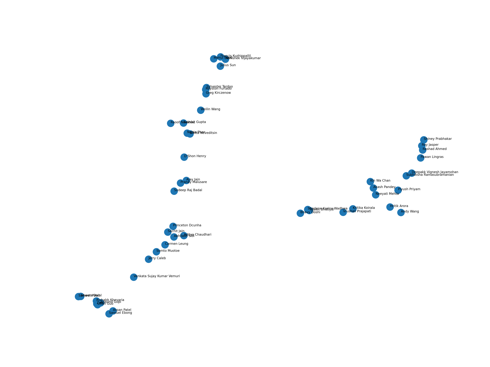

# Assignment Three (Embedding Icebreaker)

  

## What Are Embeddings?
Insert answer to question 1 here

## Data Analysis
Insert answer to question 2 here

## Embedding Sensitivity Tests
Insert answer to question 3 here

## Dimension Reduction Analysis
Insert answer to question 4 here

## Notes
Using Python 3.10 conda environment
```commandline
conda env update -f environment.yml
```

